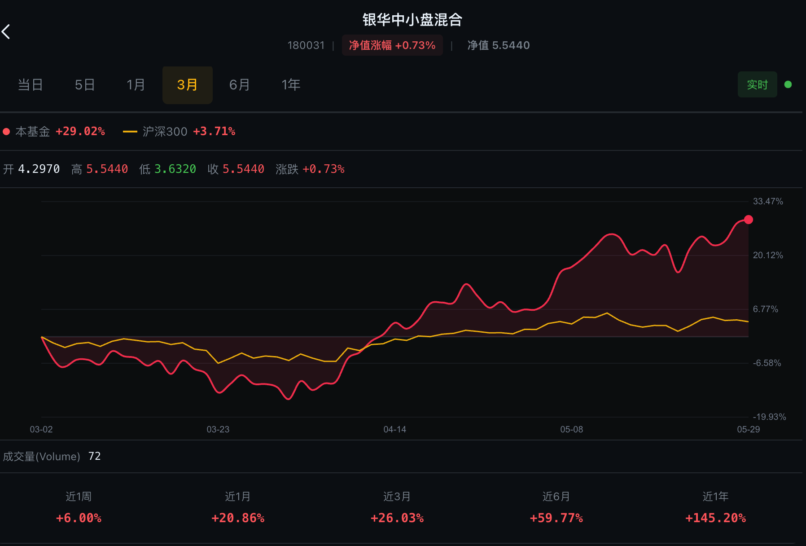
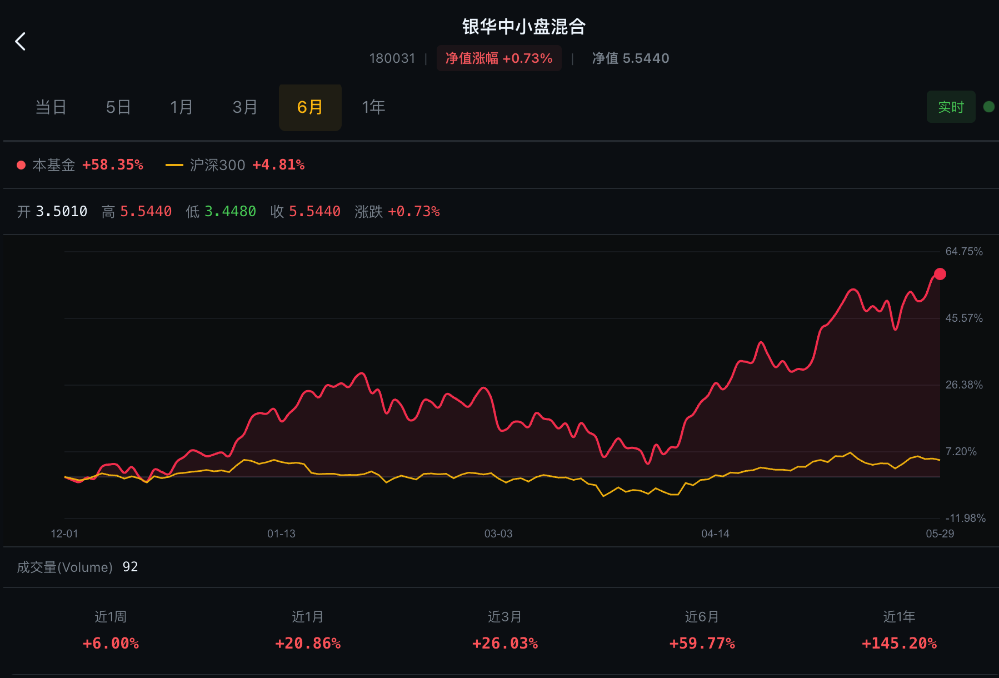
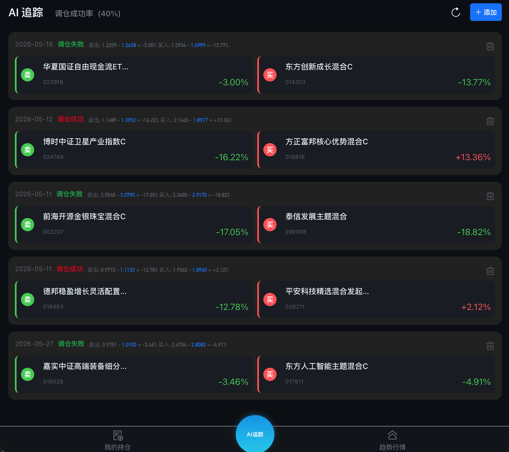
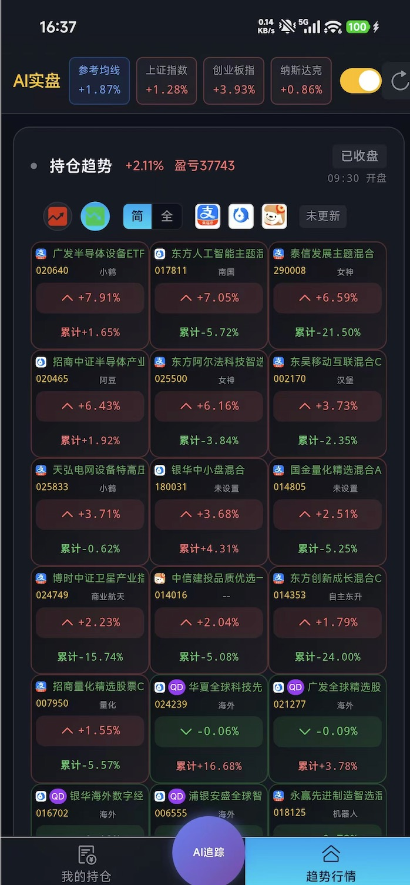

# AI百万实盘

一款功能丰富的开源基金管理工具，专为 Android 平台打造。


## 功能特点

### 核心功能
- **实时估值** - 秒级刷新基金实时估值数据
- **趋势行情** - 直观板块分析基金的趋势
- **基金详情** - 完整的基金信息展示

### 新版本特性
- **全新UI** - 主页增加量化观察，量化追踪大V持仓。帮你精准跟上热点

- **均线系统** - 支持均线参考，低于黄线买入，高于黄线卖出。让你的操作变得简单。拉高收益


- **AI追踪** - 新增AI追踪功能，根据日期添加调仓记录。帮你追踪每一次调仓。同时支持AI分析。不遗忘以前的调仓记录
  精准复盘调仓效果。帮你优化调仓动作

- **AI追踪简版** - 新增简单版AI追踪，红色表示调仓成功，绿色表示调仓失败。

- **全新设计移动端首页** - 新增全新设计移动端首页布局，提升用户体验。

## 快速开始

### AI策略验证
  
欢迎关注支付宝盘友圈：**AI百万实盘**

### 本地开发

```bash
# 克隆项目
git clone https://github.com/lee727n/millionFund
cd millionFund

# 安装依赖
npm install

# 启动开发服务器
npm run dev

# 构建生产版本
npm run build
```

### Android APK 构建

```bash
# 构建 Web 并同步到 Android
npm run build
npx cap sync

# 命令行构建 Release 版本（需要 JDK 21）
cd android
./gradlew assembleRelease
```

APK 输出位置：
- Debug: `android/app/build/outputs/apk/debug/app-debug.apk`
- Release: `android/app/build/outputs/apk/release/app-release.apk`

## 技术栈

- **前端框架**：Vue 3 + TypeScript
- **构建工具**：Vite 7
- **UI 组件**：Vant 4
- **移动打包**：Capacitor 7
- **路由管理**：Vue Router 4

## 免责声明

⚠️ **重要提示**

- 本工具仅供学习交流使用，不构成任何投资建议
- 基金估值数据仅供参考，以基金公司公布的净值为准
- 数据刷新有延迟，仅供学习和参考
- **投资有风险，理财需谨慎**
- 下载后请在 24 小时内删除

## 开源协议

本项目基于 [MIT License](./LICENSE) 开源。

